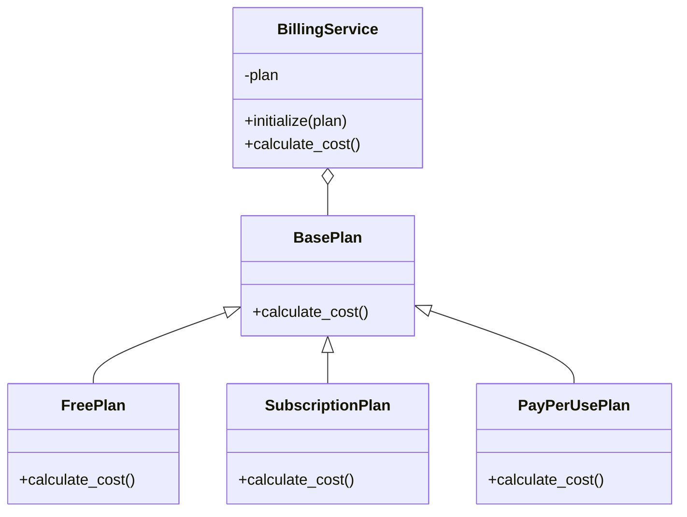

# (YET ANOTHER) STRATEGY DP EXAMPLE

The [Strategy](https://refactoring.guru/design-patterns/strategy), along with the [Template](https://refactoring.guru/design-patterns/template) design patttern (DP) are my most used DPs. This is not coincidence: they are really useful reuse structures. This project shows (yet another) example of this traditional DP.

> I have other examples in [Java](https://github.com/gabrielcostasilva/dp-strategy.git) and [Ruby](https://github.com/gabrielcostasilva/dp-strategy-ruby.git).

## Project Overview
The class diagram below shows the classes in this project. `Billing::BasePlan` is the _strategy_ superclass whereas the subclasses represent _concrete strategies_. `Billing::BillingService` is the _context_. The _client_ role is omitted here.

